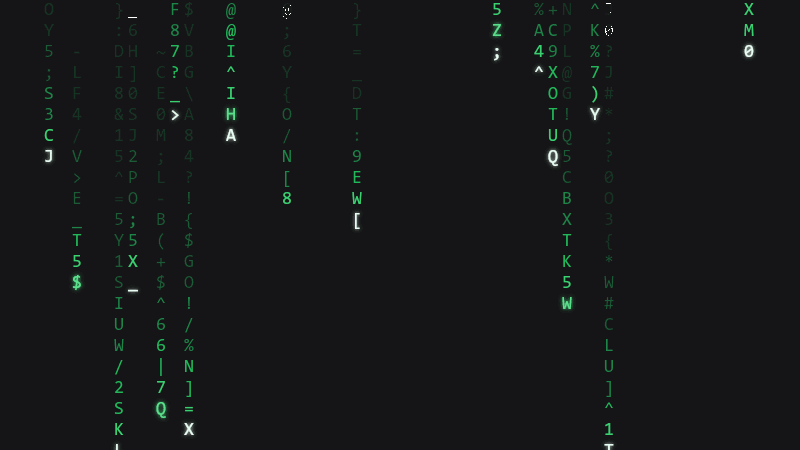

# dsh-codefall【数字雨】开机动画 + 绿色语义主题。

 
[](https://github.com/4444Hao/dsh-codefall/actions/workflows/test.yml)



## 快速开始

```bash
dsh plugin --profile desktop add github:4444Hao/dsh-codefall   
# 安装（约 8 秒，自动登记 bundle）
# 然后重启应用
# 初次使用时，开机动画会默认直到你移动鼠标/点击/滚轮/按键结束
```
其他方法：
```bash
dsh plugin --profile desktop add https://github.com/4444Hao/dsh-codefall/releases/download/v0.1.0/dsh-codefall-0.1.0.tgz
```
```bash
dsh plugin --profile desktop add D:\下载\dsh-codefall-0.1.0.tgz
```

浅色模式是"墨迹雨"（白底深绿）：


## 设置 → **开机动画codefall**：

| 项 | 取值 | 默认 | 生效 |
|---|---|---|---|
| 结束方式 | 交互后结束 / 3 秒后自动继续 | **交互后结束** | 下次启动 |
| 雨密度 | 30%–100% | 85% | 下次启动 |
| 雨速 | ×0.40–×2.50 | ×1.00 | 下次启动 |
| 画质 | 高 / 标准 / 省电 | 标准 | 下次启动 |
| 明暗 | 跟随系统 / 深色 / 浅色 | 跟随系统 | 下次启动 |
| **绿色主题** | 开 / 关 | **开** | **立即** |
| **绿色色调** | 110–175° + 三个预设 | **雨绿 145°** | **立即**（拖动即变） |

卸载：`dsh plugin --profile desktop remove dsh-codefall`。主题层会随插件一起移除。


## 注意

1. **桌面端改动画参数需重启**（绿色主题与色相除外，即时生效）。
2.  **只在 Windows 桌面端人工验证过**。macOS / Linux 的代码路径是安全的（标题栏部分是 Windows 专属，找不到探针时完全空操作），但没实机验证。
3. 需要 Harness **0.2.0-rc.2 或更高**。插件本身零依赖，`react` 由宿主提供。
4. 想装在 Web 界面就把 `--profile desktop` 换成 `--profile web`。

## 许可证

[MIT](LICENSE)
