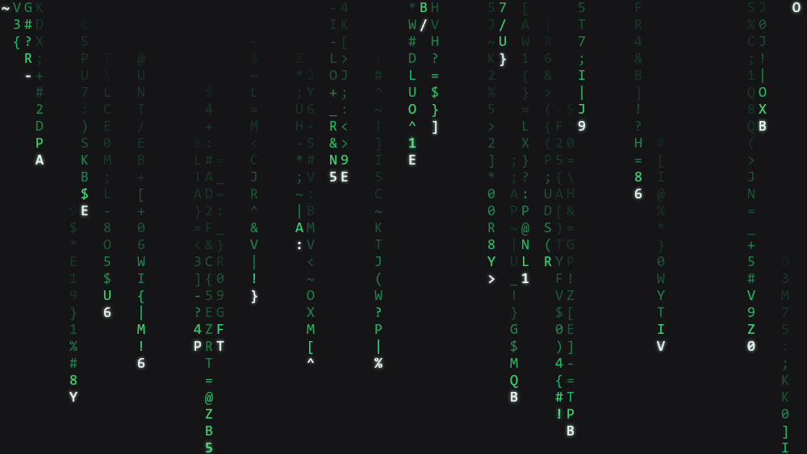
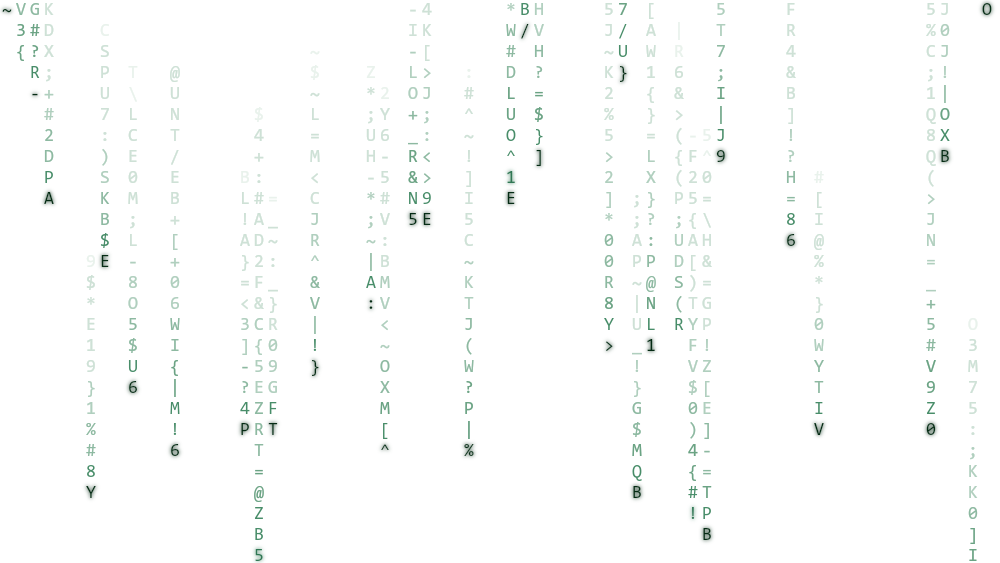
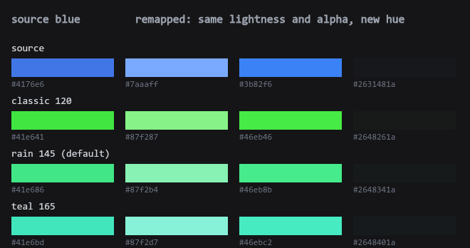

# dsh-codefall

为 [DeepSeek Harness](https://github.com/deepseek-ai) 提供**绿色数字雨开机动画**与**绿色语义主题**的插件。

轻、快、结束即零负载；运行时**不依赖任何 npm 包**。



---

## 它做什么

| | |
|---|---|
| **开机动画** | 冷启动时铺满一屏绿色数字雨。默认**只有雨**——没有标题、没有文字、没有加载进度条。宿主就绪后雨继续下，直到你移动鼠标/点击/滚轮/按键（或按设置改成 3 秒后自动继续）。带着"确认开机"的仪式感，又不挡任何操作。 |
| **绿色主题** | 把界面里的蓝色系品牌色换成与数字雨相配的绿色：按钮、链接、选中态、气泡、图标全部跟随。**保留原本的白色字体与黑色背景**，语义状态色（成功绿/警告黄/危险红）一律不动。 |
| **设置** | 在「设置」里拥有一栏自己命名的 **开机动画codefall**，动画参数与主题色相都在里面调，**改完即时生效**（动画参数除外，见下文）。 |

明暗两套都支持：



## 环境要求

- DeepSeek Harness **0.2.0-rc.2 或更高**
- 桌面端（Windows / macOS / Linux）或 Web 界面
- **插件本身零运行时依赖**；`react` 由宿主提供

## 安装

```bash
# 从 GitHub 安装（已实测：8 秒左右，装完即用，无需第二步）
dsh plugin --profile desktop add github:4444Hao/dsh-codefall

# 或从 npm（已发布后可用）
dsh plugin --profile desktop add dsh-codefall
```

插件管理器会把包装进该 profile 并**自动把 `dsh-codefall` 登记为 bundle**——不需要手工编辑 `package.json` 或 `cordis.patch.yml`。（依据：CLI 的 `plugin` 命令在 pnpm 安装后会对照已安装状态对账 `dsh.profile.bundles`，凡是声明了 `dsh.bundle` 的依赖自动入列。）

装完**重启应用**（桌面端在启动时读取注入与客户端 bundle）。想装在 Web 界面就把 `--profile desktop` 换成 `--profile web`。

**验证是否装上**：重启后在这个机器上打开 <http://127.0.0.1:19387/codefall/api>（回环地址，无需令牌）。能返回一段 JSON 就说明宿主半边在工作。

**卸载**：

```bash
dsh plugin --profile desktop remove dsh-codefall
```

卸载后绿色主题层会随插件卸载一起移除，不留残留样式。

## 设置

设置 → **开机动画codefall**：

| 项 | 取值 | 默认 | 生效时机 |
|---|---|---|---|
| 结束方式 | 交互后结束 / 3 秒后自动继续 | **交互后结束** | 下次启动 |
| 雨密度 | 30%–100% | 85% | 下次启动 |
| 雨速 | ×0.40–×2.50 | ×1.00 | 下次启动 |
| 画质 | 高 / 标准 / 省电 | 标准 | 下次启动 |
| 明暗 | 跟随系统 / 深色 / 浅色 | 跟随系统 | 下次启动 |
| **绿色主题** | 开 / 关 | **开** | **立即** |
| **绿色色调** | 110–175° + 三个预设 | **雨绿 145°** | **立即**（拖动即变） |

> **为什么动画参数要下次启动才生效**：首帧必须在任何客户端代码运行之前就正确，所以动画参数是宿主在注入时快照的。**绿色主题不受这个限制**——它是客户端在运行时注册的覆盖层，所以开关与色相都是即时的。

更细的参数（标题文字、状态行、闲置降档、超时、诊断）在 `$DSH_HOME/codefall.json` 里可调，也可以用同一个路由读写：

```bash
curl http://127.0.0.1:19387/codefall/api
```

## 绿色主题怎么做的

界面配色是**三层 token 体系**：`--dsw-static-*` 原始色阶 → `--dsw-alias-*` 语义别名（绝大多数是 `var()` 引用）→ 组件样式。所以**只覆盖 29 个蓝色原始色阶**，所有指向它们的别名就跟着变，包括 `color-mix()` 这类计算式。

映射规则只有一条：**保留明度，换掉色相**。



- **保明度**：设计系统的全部对比度关系都建立在明度上，保 L 才能"换皮而不改可读性"。实测跨色相 HSL 明度完全一致。
- **收饱和度**：原蓝色饱和度 77–100%，直接搬过来是荧光绿；收进 55–80%，落在数字雨自己的色阶上（`#22c55e` 系）。
- **保留透明度**：别名层里有带 alpha 的蓝色 tint，丢 alpha 会变成实色。

预设三个停靠点：**雨绿 145°**（默认，即数字雨自己的绿）、**经典 120°**（更黄更亮的黑客绿）、**青碧 165°**（偏青）。范围限制在 110–175°，再往两边就偏黄或偏青了。

**故意不动的东西**：语义状态色（成功/警告/危险）、代码 diff 与文件 diff 配色、琥珀与红、以及作为"白字黑底"的中性色阶。生成器与测试**双重断言**这条边界——不是注释里的承诺。

> 一个反直觉的坑：`--dsw-static-neutral-bluish-*` 有一族"偏蓝的中性色"，它们**按色相看是蓝的**（hue 210–222），但正是白字黑底本身。照着"色相是蓝就绿"去做会把墨色染绿。所以清单是量出来的，不是看名字猜的。

## 已知限制与取舍

这些都是**有意的选择或已披露的代价**，不是待修的 bug：

1. **桌面端改动画参数需重启**（绿色主题与色相除外，见上）。
2. **Windows 标题栏那三个图标**（最小化/最大化/关闭）是 Chromium 的窗口控件叠加层，画在网页内容**之上**，页面里的 `z-index` 够不到。本插件通过**改 caption 配色**把它们隐掉（图标仍可点击，窗口功能不受影响）。这是**依赖宿主内部实现的 hack**，可用 `hideWindowControls: false` 关闭。它最坏的情况是图标看不见但仍可点，且下次启动自动恢复。
3. **代码块的语法高亮只跟随了两个蓝色**（`constant`/`link`）。关键字粉、参数橙、函数紫、注释灰**故意保留**——那是功能性色码，全绿换来的是可读性下降而不是主题感。
4. **不给性能数字**。README 不写帧率/启动开销的实测值，因为**尚未在真实硬件上量过**。宁可空着也不写没测过的数。
5. **首次激活会读一次 `GET /codefall/api`**（回环请求）来取主题设置。它发生在启动遮罩之下，不可见。
6. **设置路由没有令牌**：只监听回环、只接受 `application/json`、有体积上限。任何本机进程都能读写它——与"本机插件配置"的风险等级相称。

## 开发

```bash
# 三个测试套件；host 与 client 不需要任何依赖
node tools/host-test.mjs     # 96 项：用假 Cordis 上下文真的把注入脚本跑起来
node tools/client-test.mjs   # 67 项：用极小 React 桩把设置界面渲染并点击一遍
node tools/smoke.mjs         # 29 项：渲染器的像素级行为（需要 canvas）

# 一次跑完
npm test
```

`smoke.mjs` 需要可选依赖 `@napi-rs/canvas`（像素检查），另外两个套件**零依赖**：

```bash
npm i -D @napi-rs/canvas      # 或 pnpm add -D @napi-rs/canvas
node tools/smoke.mjs
```

Windows 标题栏那部分、以及主题在真实界面里的观感，**只能靠人在真实应用里看**——离线测试能证明的是"激活不会抛错""数学与生成器一致""明度不变"。

### 主题管线（可复现）

主题覆盖层是**生成**的，不是手写的。整条管线只需要你自己机器上那份安装：

```bash
node tools/extract-app-assets.mjs             # 从本机 app.asar 取出所需的前端资源（自动定位）
node tools/extract-theme-css.mjs              # 抽出 8 张 token 样式表
node tools/green-map.mjs                      # 审阅：每个蓝色色阶与它的绿色
node tools/green-map.mjs --emit               # 写入 lib/client.js + 黄金样本
```

`extract-app-assets.mjs` 读取的是**你自己安装的应用**里的资源（DeepSeek 的代码），所以输出落在 gitignore 的 `tools/out/` 里，永远不会被提交。

运行时算色的正确性由**黄金样本**钉住：`tools/fixtures/green-145.json` 是 145° 下应由生成器产出的结果，测试断言浏览器半边的运行时计算**逐字节相同**。

## 仓库结构

| 路径 | 作用 |
|---|---|
| `lib/index.js` | 宿主半边：把首帧脚本注入 HTML、设置路由、绿色主题的配置面 |
| `lib/boot.js` | 遮罩控制器：就绪交接、结束策略、闲置降档、Windows 标题栏隐藏 |
| `lib/renderer.js` | 纯渲染器：字形图集、亮度波运动模型、浅色"墨迹雨" |
| `lib/client.js` | 客户端半边：就绪信号、设置分区、绿色主题覆盖层（含运行时算色） |
| `cordis.patch.yml` | 往 profile 里插一条 loader 记录 |
| `preview/index.html` | **开发用的演示页**：双击即可在浏览器里看渲染器与动画参数（`file://` 直接打开）。它只覆盖动画，**不含主题**——主题需要一个真实的 DSH 界面才能看到 |
| `tools/` | 全部离线验证与生成工具 |
| `docs/DESIGN.md` | 工程日志：环境事实、官方扩展点契约、实测证据、一次真实事故的复盘 |

`docs/DESIGN.md` 是这份插件的**内部工程文档**——里面记录了对 `0.2.0-rc.2` 逐条核实过的扩展点契约（首帧注入的两条通道、就绪信号的缺失、设置命名空间为何必须自己实现、token 体系的三层结构），以及踩过的坑。想改这个插件的人应该先读它。

## 许可证

[MIT](LICENSE)
